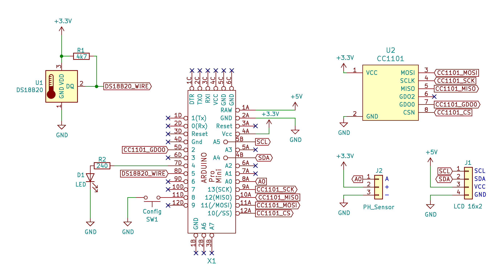
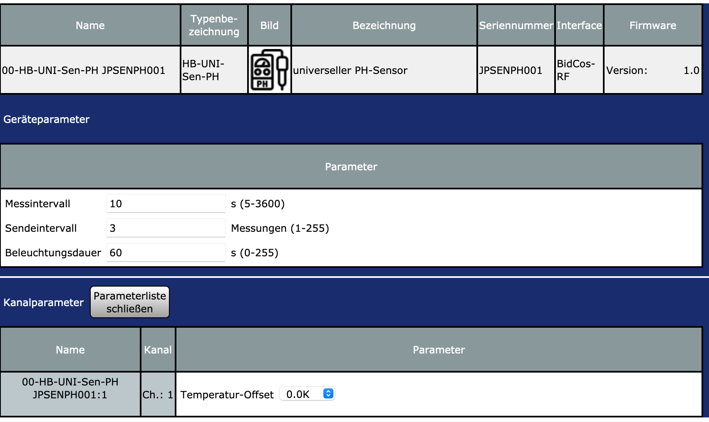

# HB-UNI-Sen-PH

universeller HomeMatic PH-Sensor

#### Bauteile:

- Arduino Pro Mini (3.3V / 8MHz)
- CC1101 868MHz Funkmodul 
- PH Sensor https://www.dfrobot.com/product-1782.html
- I2C LCD Display 2x16 
- DS18B20 Temperatursensor
- Widerstände: 240 Ohm, 4,7k

#### Schaltungsübersicht

#### CCU Einstellungen

